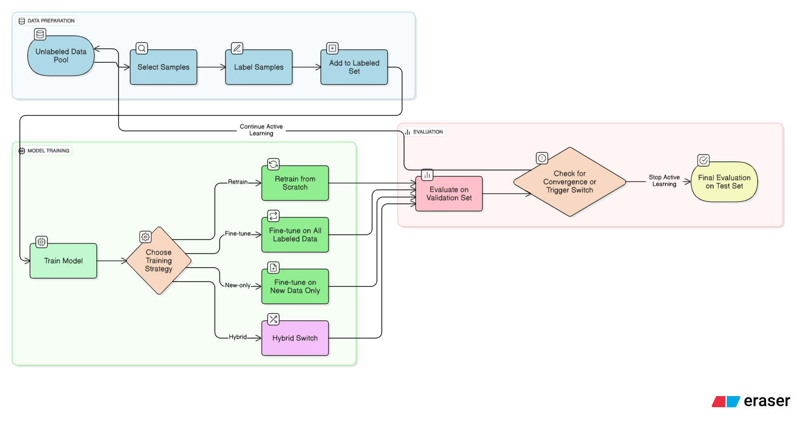

# HybridAL: Adaptive Training Strategy Switching in Pool-Based Active Learning Using ΔF1  

## Overview  
This repository contains the code and experiments for **HybridAL**, an adaptive active learning framework for text classification.  
Instead of training with a fixed strategy (retrain or fine-tune) in all active learning rounds, HybridAL dynamically **switches strategies** based on validation performance improvements (ΔF1).  
- **New-only**: forgets past knowledge
- **Retrain**: robust, prevents bias but costly.  
- **Fine-tune**: efficient, but risks drift/overfitting.  
- **HybridAL (proposed)**: start with retrain, switch to fine-tune when ΔF1 stabilizes.  

This approach reduces compute cost while maintaining accuracy.  
We evaluate HybridAL on **AG News**, **IMDb Reviews**, and **Jigsaw Toxic Comments**.  

---
## Pipeline  

The project follows the standard **pool-based active learning pipeline**:  

1. **Initialization** – Start with a small labeled dataset and a large pool of unlabeled samples.  
2. **Model Training** – Train a model on the current labeled pool.  
3. **Evaluation** – Evaluate the model on a validation set to monitor performance.  
4. **Querying / Sampling** – Select the most informative samples from the unlabeled pool (e.g., random, entropy, uncertainty).  
5. **Annotation** – Add the newly labeled samples to the labeled pool.  
6. **Iteration** – Repeat training, evaluation, and querying until the budget (rounds or labels) is exhausted.  
7. **Final Testing** – Evaluate the final model on the held-out test set.  

HybridAL extends this pipeline by **adaptively switching the training strategy** (from retraining to fine-tuning) when performance improvements (ΔF1) stabilize, reducing computational costs while preserving accuracy.

  

---

## Repository Structure
```
deltaf1-hybrid-active-learning/
│
├── adaptive_al/                        # Core implementation of active learning framework
│   ├── active_learning.py              # Active learning loop orchestration
│   ├── config.py                       # Config management
│   ├── evaluation.py                   # Evaluation metrics
│   ├── pool.py                         # Data pool management
│   ├── __init__.py
│   │
│   ├── samplers/                       # Querying / sampling methods
│   │   ├── base_sampler.py
│   │   ├── entropy_sampler.py
│   │   ├── entropy_on_random_subset_sampler.py
│   │   ├── random_sampler.py
│   │   └── __init__.py
│   │
│   ├── strategies/                     # Training strategies
│   │   ├── base_strategy.py
│   │   ├── retrain_strategy.py
│   │   ├── fine_tuning_strategy.py
│   │   ├── new_only_strategy.py
│   │   ├── deltaf1_strategy.py
│   │   └── __init__.py
│   │
│   └── utils/                          # Utility modules
│       ├── data_loader.py
│       ├── text_datasets.py
│       └── __init__.py
│
├── data/                               # Datasets (AG News, IMDb, Jigsaw, etc.)
│
├── eda_preprocessing/                  # Exploratory data analysis notebook
│   └── all_datasets_eda.ipynb
│
├── experiments/                        # Experiment results
│
├── media/                              # Figures, plots, and diagrams
│
├── run_example.ipynb                   # Example notebook to run a demo pipeline
├── experimentation.py                  # Script to run experiments with Optuna
├── figure_plotter.py                   # Helper script for plotting results
├── requirements.txt                    # Python dependencies
├── result_example.json                 # Example output format
└── README.md                           # Project documentation
```

---

## Setup Instructions  

### Requirements  
- Python 3.11  
- GPU recommended
- Dependencies are listed in `requirements.txt`  

### Installation  
```bash
git clone https://github.com/naghamo/deltaf1-hybrid-active-learning.git
cd deltaf1-hybrid-active-learning
pip install -r requirements.txt
```

---

## Running the Code

### Option A — Hyperparameter Optimization (`experimentation.py`)

The main experiment script supports full command-line configuration. 
For `DeltaF1Strategy`, Optuna automatically optimizes `epsilon`, `k`, and `validation_fraction` hyperparameters (15 hours by default). 
Other strategies run with fixed provided configurations.

```bash
# Run with all defaults
python experimentation.py

# Run specific experiments
python experimentation.py --datasets agnews imdb --strategies RetrainStrategy FineTuneStrategy

# Customize hyperparameters
python experimentation.py --epochs 10 --learning-rate 3e-5 --batch-size 32

# Run with single seed for quick testing
python experimentation.py --seeds 42 --total-rounds 20

# See all available options
python experimentation.py --help
```

**Key Arguments:**
- `--datasets`: Choose from `agnews`, `imdb`, `jigsaw` (space-separated)
- `--strategies`: Choose from `DeltaF1Strategy`, `RetrainStrategy`, `FineTuneStrategy`, `NewOnlyStrategy`
- `--seeds`: Random seeds for reproducibility (default: 42 43 44)
- `--model`: Hugging Face model (default: `distilbert-base-uncased`)
- `--epochs`: Training epochs per round (default: 5)
- `--total-rounds`: Maximum AL rounds (default: 40)
- `--save-dir`: Output directory (default: `./experiments/sep_25`)

### Option B — Notebook workflow (`run_example.ipynb`)

1. Launch Jupyter: `jupyter lab`
2. Open `run_example.ipynb` and run all cells
3. This notebook demonstrates the `adaptive_al` module usage with example configurations

### Outputs and Visualization

- Results are saved under `./experiments/<experiment_subdir>/`
- Includes metrics (per-round F1 / ΔF1), the config used, and logs  
- Use `figure_plotter.py` to turn results into plots (examples are in `media/`)  

---

## Datasets

| Dataset | Task Type                    | Size (Train/Val/Test) | #Classes | Notes      |
| ------- | ---------------------------- |-----------------------| -------- | ---------- |
| AG News | Topic classification         | 108k / 12k / 7.6k     | 4        | Balanced   |
| IMDb    | Sentiment analysis           | 35k / 5k / 10k        | 2        | Balanced   |
| Jigsaw  | Toxic comment classification | 111.7k / 16k / 31.9k  | 2        | Imbalanced |

- Sample CSVs (`train_agnews.csv`, `test_agnews.csv`, `imdb.csv`, `jigsaw.csv`) are included in the repo for quick experiments.  
- Preprocessing and label distributions are analyzed in the `eda_preprocessing/` notebooks.

---

## Reproducibility

- No values are hardcoded in training scripts.  
- Runs can be repeated with fixed random seeds.  
- By default, we use three seeds {42, 43, 44} and average results.  
- All necessary results, configs and outputs are saved in `experiments/`.

---

## Team

* **Nagham Omar**
* **Evgeny Mishliyakov**
* **Vsevolod Rusanov**
* **Maya Rozenshtein**

Technion – Israel Institute of Technology

---

## Citation

If you use this work, please cite:

```
@misc{omar2025hybridal,
  title={HybridAL: Adaptive Training Strategy Switching in Pool-Based Active Learning Using ΔF1},
  author={Nagham Omar and Evgeny Mishliyakov and Vsevolod Rusanov and Maya Rozenshtein},
  year={2025},
  institution={Technion – Israel Institute of Technology},
  howpublished={\url{https://github.com/naghamo/deltaf1-hybrid-active-learning}}
}
```

---

✨ This repository contains all source code.


